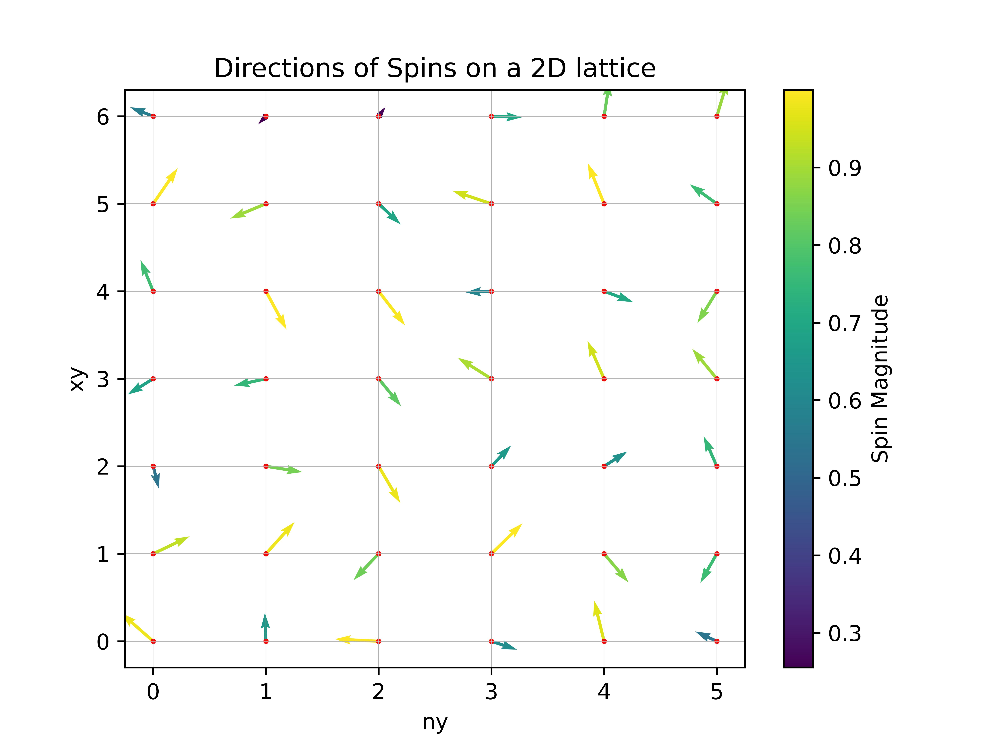

[](https://classroom.github.com/a/Kyi6HUih)
# Search for a magnetic skyrmion

- Deadline: **Friday 20th October 2023**, 16:00 BST

Feel free to modify this `README.md` file as necessary to document your project.

# mcsim- A package to implement a Monte Carlo Simulation to find magnetic skyrmions.

## Overview
This repository contains the mcsim package, which can be used to simulate spins in a 2 dimensional lattice.

### Repository Structure:
The main directory is mcsim/. This directory contains all the modules that are needed to run the MC simulation. The modules that are needed for this simulation are system.py, spins.py, and driver.py. Within this directory, there is another directory called tests/, which contains the tests for all the modules.

### Information about modules in mcsim/

spins.py

This module contains the Spins class and creates a (nx,my,3) 2D lattice (numpy arrays) where the 3 dimension represents the spin vector. It contains methods to calculate mean of the spin vectors, normalise vectors and a plotting method to visualize the spin directions based on the 2D lattice created.

system.py

This module computes the total energy of the spin system using the energy method. This total energy is calculated from the results of the zeeman, anisotropy,exchange, and dmi methods. These energies are calculated from the 2D numpy arrays.

driver.py

This module contains the Driver class whose drive method allows running the simulation.
The algorithm works as follows:
1. Compute the system energy
2. Choose a random spin (each spin has an equal probability of being chosen)
3. Randomise the spin
4. Calculate the energy of the system with the new randomised spin.
5. If the energy difference (E1-E0) is smaller than zero, accept the spin in step 3. Otherwise, revert back to the original system.

Over time, the spins will arrange in the most favorable energy configuration.

### Dependencies
The code runs on python 3.11 and requires
```
numpy>=1.25.2
matplotlib>=3.7.2
pytest>=7.4.2
```


### 1: Installation

1.1 Create a new virtual environment using the following command :
```
conda create -n {name of your environment} python=3.11
```

1.2 Activate your virtual environment:
```
conda activate {name of your new virtual environment}
```

1.3 Clone the git repository into your new virtual environment.
```
git clone https://github.com/ese-msc-2023/npp-assessment-2-gems-at223.git
```
1.4 navigate to the repository

1.5 enter
```
pip install .
```

### 2: Usage

2.1
In a new python script,import the package by typing
```python
import mcsim
```

2.2 Initliaze the values of the system
```python
dimensions = (6, 7)  # define the dimensions of the lattice; 6x7 in this case
spin_system = mcsim.Spins(n=dimensions)  # create the 2D lattice
spin_system.randomise()  # randomise all the spins in the lattice
B = (1, 1, 1)  # add the magnetic field direction
K = 1  # add the anisotropy constant
u = (0, 1, 0)  # add the anisotropy axis
J = 1  # add the coupling constant
D = 1  # add the DMI constant
```
2.3 Create a system you want to simulate and run the simulation by calling:

```python
system_to_simulate = mcsim.System(s=spin_system, B=B, K=K, u=u, J=J, D=D) # create an instance of the system you want to simulate (spin_system)
driver = mcsim.Driver() # create an instance of the driver class
driver.drive(system_to_simulate, n=100) # run the Metropolis Monte Carlo simulation with 100 repetitions
```

Plot the result of the Monte Carlo Simulation:
```python
system_to_simulate.s.plot()
```

The result should be:


You can get additional information. For example, if you call
```python
 print(spin_system.mean())
 print(system_to_simulate.anisotropy())
 print(system_to_simulate.zeeman())
 print(system_to_simulate.dmi())
 print(system_to_simulate.exchange())
 print(system_to_simulate.energy())
 ```
 You can get the mean values of the x,y,z components of  spin_system as a 1D array, the total anisotropy of the system (scalar), the total zeeman energy of the system (scalar), the total DMI energy (scalar), the total exchange energy (scalar) and the total energy of the system (scalar).

 Note: The examples have been adapted from the test_driver,py file.

### 3: Testing

In order to run the tests, run
```
pytest or pytest -v (gives more information)
```
in your terminal. All tests should run successfully.

### 4 : Author

Anthony Tran

### 5: License
MIT License
